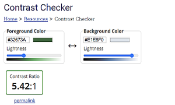

<h1 align="center"> </h1>  

# Contents

* [**User Experience UX**](<#user-experience-ux>)
    *  [User Stories](<#user-stories>)
    * [Design](<#design>)
        *  [Colour Scheme](<#colour-scheme>)
        *  [Typography](<#typography>)
    * [Wireframes](<#wireframes>)
* [**Features**](<#features>)
    * [Current Features](<#current-features>)
    * [Future Features](<#future-features>)
* [**Technologies Used**](<#technologies-used>)
* [**Testing**](<#testing>)
    * [Validation](<#validation>)
    * [Responsive](<#responsive>)
    * [Lighthouse](<#lighthouse>)
    * [Testing User Stories from User Experience](<#testing-user-experienece>)
* [**Deployment**](<#deployment>)
* [**Credits**](<#credits>)
    * [**Content**](<#content>)
*  [**Acknowledgements**](<#acknowledgements>)

[View the live project here.](https://colm1711.github.io/snake_game/)

This is the main marketing website for Code Institute. It is designed to be responsibe and accessible on a range of devices, making it easy to navigate for potential students and partners.

<h2 align="center"></h2>

## User Experience (UX)

-   ### User stories

    -   #### First Time Visitor Goals

        1. As a First Time Visitor, I want to easily understand the main purpose of the site.
        2. As a First Time Visitor, I want to be able to easily navigate around the site to find content and discover new features.
        3. As a First Time Visitor, I want to  want to locate their social media links to see their followings on social media.

    -   #### Returning Visitor Goals

        1. As a Returning Visitor, I want to find new features and interactions that are available on the site.
        2. As a Returning Visitor, I want to find the best way to get in contact with the organisation with any questions I may have via media links.

    -   #### Frequent User Goals
        1. As a Frequent User, I want to check to see if there are any newly added challenges or levels.
        2. As a Frequent User, I want to check to see if there are any new highscores.        

-   ### Design
    -   #### Colour Scheme
        - The colour scheme eventually chosen is one based on off white with green, purple and black. With dark mode choosen similar colors but with contrasts that suited the background color chnage to make more accessible.

        - Light mode:  

          

          

        - Dark mode:  

          

        
        

    -   #### Typography
        The fonts chosen were 'Mrs Sheppards' for the heading and 'Syne' for the body text. They fall back to cursive and sans-serif respectively. 
        *  'Mrs Sheppards' was chosen for the heading to give the user an inital feeling of retro to tie in with the game. The cursive style is to increase the restor feel of the font.
        * 'Syne' is used for the body text as it provides a nice contrast to the cursive whilst being easy to read for all.

[Back to top](<#contents>) 

*   ### Wireframes

    The wireframes for Snake game were produced in Balsamiq. They were designed for a full width display and with mobile device first desgin approach. The final site varies slightly from the wireframes due to developments that occured during the creation process.

    * Mobile wireframe image  
     

    * Tablet wireframe image  
     

    * Desktop wireframe image  
     

[Back to top](<#contents>)

## Features

### Current Features

-   Responsive on all device sizes with mobile site first design in mind with grid containors used to keep focus of content in center of screen as device screen size increases.

- Header is designed with retro style in mind to tie user in with game 'classic' nature. This is most highlighted when user switches to dark mode:
 

- User is presented with welcome message which is intended to outline main purpose of site which is to play snake game. Users name is saved in session storage.  
 

- Toggle button intended to add user interaction so they can adjust website to preference which is saved to local storage.  
 

- Modal button is there as interaction point for user. They can click on this to learn more about the game and how to play.
 

- Unmute/Mute button, added to give user more interaction with website to play music while playing snake game.
  
 

- This section is last part of users journey through site which holds copyright information and also links to social media if user wants to persuse more information on developer and game.  
 

### Future Features

- Scoreboard modal so users can keep track of score in real time.

- Game button controls for non-keyboard users of sites

[Back to top](<#contents>)

## Technologies Used

### Languages Used

-   [HTML5](https://en.wikipedia.org/wiki/HTML5)
-   [CSS3](https://en.wikipedia.org/wiki/Cascading_Style_Sheets)
-   [Javascript](https://en.wikipedia.org/wiki/JavaScript)

### Frameworks, Libraries & Programs Used

1. [Hover.css:](https://ianlunn.github.io/Hover/)
    - Hover.css was used on the Social Media icons in the footer to add the float transition while being hovered over.
1. [Google Fonts:](https://fonts.google.com/)
    - Google fonts were used to import the 'Titillium Web' font into the style.css file which is used on all pages throughout the project.
1. [Font Awesome:](https://fontawesome.com/)
    - Font Awesome was used on all pages throughout the website to add icons for aesthetic and UX purposes.
1. [Git](https://git-scm.com/)
    - Git was used for version control by utilizing the Gitpod terminal to commit to Git and Push to GitHub.
1. [GitHub:](https://github.com/)
    - GitHub is used to store the projects code after being pushed from Git.
1. [Balsamiq:](https://balsamiq.com/)
    - Balsamiq was used to create the [wireframes](https://github.com/) during the design process.

[Back to top](<#contents>)

## Testing

### Validation

Snake site has been throughly tested. All the code has been run through the [W3C html Validator](https://validator.w3.org/) and the [W3C CSS Validator](https://jigsaw.w3.org/css-validator/) & [JSHint](https://jshint.com/) sites. Minor errors were found on main page and in the script.js. After a fix of sheets and retest, no errors were returned for both. 

1. HTML Validation:
  

1. CSS Validation:
 

1. Snake Validation:  
 

1. Username Validation:  
 

1. Darkmode Validation:  
 

1. Utils Validation:  
 

### Responsive

|        | Pixel     | iPhone 6 | iPad | iPad Pro | Display <1200px | Display >1200px |
|--------|-----------|----------|------|----------|-----------------|-----------------|
| Render | pass      | pass     | pass | pass     | pass            | pass            |

### Lighthouse

#### Mobile  
  

*   Mobile results were affected(86%) by audio file, but after compressing this reduced performance hit and brought score to 99%.

#### Desktop
   

*   Best practices for both lighthouse tests were affected by github related errors logging to console:

 

### Testing User Stories from User Experience (UX) Section

### Testing User Experienece

-   #### First Time Visitor Goals

    1. As a First Time Visitor, I want to easily understand the main purpose of the site.  
        * User is greated by welcome message and Site logo outline main intention of site
    2. As a First Time Visitor, I want to be able to easily navigate around the site to find content and discover new features.
        * As single page site features are kept in at heart of page near the hero game element.
    3. As a First Time Visitor, I want to  want to locate their social media links to see their followings on social media.
        * Sccial media links are kept in traditional location of footer so user is can easily locate. 

-   #### Returning Visitor Goals

    1. As a Returning Visitor, I want to find new features and interactions that are available on the site.
        * There are features such as dark mode, game music and game instructions located on site.
    2. As a Returning Visitor, I want to find the best way to get in contact with the organisation with any questions I may have via media links.
        * Sccial media links are kept in traditional location of footer so user is can easily locate.

-   #### Frequent User Goals
    1. As a Frequent User, I want to check to see if there are any newly added challenges or levels.
        * There is game speed built into the game this adds difficulty to game to keep user coming back.
    2. As a Frequent User, I want to check to see if there are any new highscores.   
        * Currently users previous score can be returned via local storage, future functionality will look to take object from local and let user edit.

### Further Testing

-   The Website was tested on Google Chrome, Internet Explorer, Microsoft Edge and Safari browsers.
-   The website was viewed on a variety of devices such as Desktop, Laptop, iPhone6, & tablet device.
-   A large amount of testing was done to ensure that all pages were linking correctly.
-   Friends and family members were asked to review the site and documentation to point out any bugs and/or user experience issues.

### Known Bugs

-   Score is not updating correctly, need to set at -1 to have displayed as 0.
    1. When script.js is called and snakeGame function runs it increments score by one. Currently score var is set to 0 which leads score to 1. Temporary solution was to set score to 0.

-   On desktop screens there is a white space appearing at end of page.(RESOLVED)
    1. Due to CSS default settings HTML and body were not filling browser page as screen width increased. This has now been resolved by setting HTML and Body height to 100%.

-   Light mode sometimes displays the dark mode canvas screen.(RESOLVED)
    1. When intially loading the page on Light mode game canvas was returning the dark mode dispaly. This was due to logic of if else statement. Updated to check if dark mode is set in local storage and if any other return object set light mode. 

[Back to top](<#contents>)

## Deployment

### GitHub Pages

The project was deployed to GitHub Pages using the following steps...

1. Log in to GitHub and locate the [GitHub Repository](https://github.com/)
2. At the top of the Repository (not top of page), locate the "Settings" Button on the menu.
    - Alternatively Click [Here](https://raw.githubusercontent.com/) for a GIF demonstrating the process starting from Step 2.
3. Scroll down the Settings page until you locate the "GitHub Pages" Section.
4. Under "Source", click the dropdown called "None" and select "Master Branch".
5. The page will automatically refresh.
6. Scroll back down through the page to locate the now published site [link](https://github.com) in the "GitHub Pages" section.

### Forking the GitHub Repository

By forking the GitHub Repository we make a copy of the original repository on our GitHub account to view and/or make changes without affecting the original repository by using the following steps...

1. Log in to GitHub and locate the [GitHub Repository](https://github.com/)
2. At the top of the Repository (not top of page) just above the "Settings" Button on the menu, locate the "Fork" Button.
3. You should now have a copy of the original repository in your GitHub account.

### Making a Local Clone

1. Log in to GitHub and locate the [GitHub Repository](https://github.com/)
2. Under the repository name, click "Clone or download".
3. To clone the repository using HTTPS, under "Clone with HTTPS", copy the link.
4. Open Git Bash
5. Change the current working directory to the location where you want the cloned directory to be made.
6. Type `git clone`, and then paste the URL you copied in Step 3.

```
$ git clone https://github.com/YOUR-USERNAME/YOUR-REPOSITORY
```

7. Press Enter. Your local clone will be created.

```
$ git clone https://github.com/YOUR-USERNAME/YOUR-REPOSITORY
> Cloning into `CI-Clone`...
> remote: Counting objects: 10, done.
> remote: Compressing objects: 100% (8/8), done.
> remove: Total 10 (delta 1), reused 10 (delta 1)
> Unpacking objects: 100% (10/10), done.
```

Click [Here](https://help.github.com/en/github/creating-cloning-and-archiving-repositories/cloning-a-repository#cloning-a-repository-to-github-desktop) to retrieve pictures for some of the buttons and more detailed explanations of the above process.

[Back to top](<#contents>)

## Credits

### Code

-   The full-screen hero image code came from this [StackOverflow post](https://stackoverflow.com)

-   [Bootstrap4](https://getbootstrap.com/docs/4.4/getting-started/introduction/): Bootstrap Library used throughout the project mainly to make site responsive using the Bootstrap Grid System.

-   [MDN Web Docs](https://developer.mozilla.org/) : For Pattern Validation code. Code was modified to better fit my needs and to match an Irish phone number layout to ensure correct validation. Tutorial Found [Here](https://developer.mozilla.org/en-US/docs/Web/HTML/Element/input/tel#Pattern_validation)

-   [MDN Web Docs](https://developer.mozilla.org/en-US/docs/Web/API/Canvas_API) : For code on how to implement, draw and interact with canvas sourced here.

-   [CSS tricks](https://css-tricks.com/snippets/javascript/javascript-keycodes/) : Codes for keys in the keydown function were sourced from here.

-   [UXPlanet](https://uxplanet.org/8-tips-for-dark-theme-design-8dfc2f8f7ab6) : Dark Theme styling

-   [MaterialDesign](https://material.io/design/color/dark-theme.html#ui-application) : Dark Theme color styling

-   [W3Schools](https://www.w3schools.com/howto/howto_css_switch.asp) : Toggle button that enables dark mode

-   [Youtube](https://www.youtube.com/watch?v=7Azlj0f9vas&t=2545s)  : Coding snake on canvas and collision logic

### Content

-   All content was written by the developer.

-   Psychological properties of colours text in the README.md was found [here]

### Acknowledgements

The site was completed as a Portfolio 2 Project piece for the Full Stack Software Developer (e-Commerce) Diploma at the [Code Institute](https://codeinstitute.net/). I would like to thank my mentor Gerry McBride, my class mates, the Slack community, and all at the Code Institute for their help and support. 

Also to my friends and family who helped test site & provide feedback and most importantly patient with me during this time!

[Back to top](<#contents>)