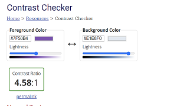
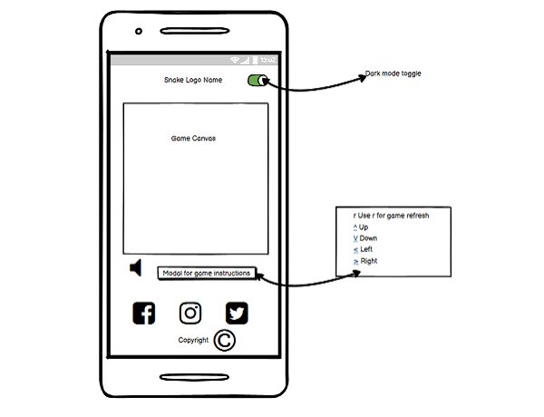
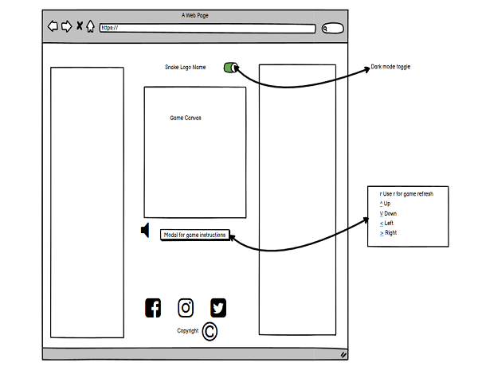
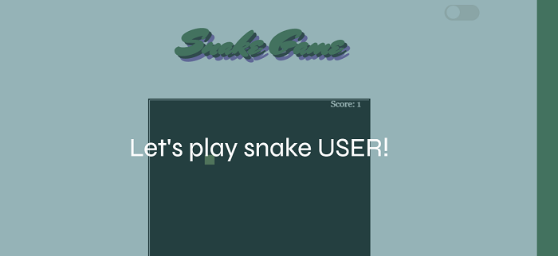
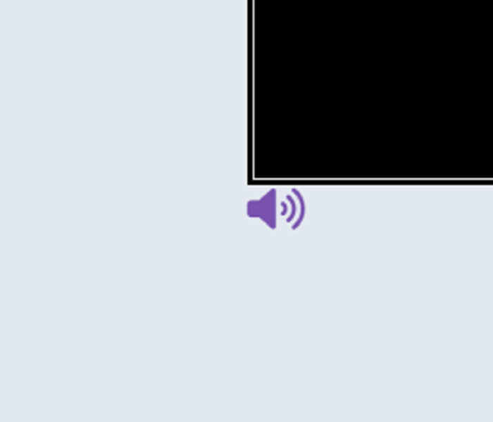

<h1 align="center">Snake</h1>

# Contents

* [**User Experience UX**](<#user-experience-ux>)
    *  [User Stories](<#user-stories>)
    * [Design](<#design>)
        *  [Colour Scheme](<#colour-scheme>)
        *  [Typography](<#typography>)
    * [Wireframes](<#wireframes>)
* [**Features**](<#features>)
    * [Current Features](<#current-features>)
    * [Future Features](<#future-features>)
* [**Technologies Used**](<#technologies-used>)
* [**Testing**](<#testing>)
* [**Deployment**](<#deployment>)
* [**Credits**](<#credits>)
    * [**Content**](<#content>)
*  [**Acknowledgements**](<#acknowledgements>)

[View the live project here.])

This is the main marketing website for Code Institute. It is designed to be responsibe and accessible on a range of devices, making it easy to navigate for potential students and partners.

<h2 align="center"></h2>

## User Experience (UX)

-   ### User stories

    -   #### First Time Visitor Goals

        1. As a First Time Visitor, I want to easily understand the main purpose of the site and learn more about the game.
        2. As a First Time Visitor, I want to be able to easily navigate around the site to find content and discover new features.
        3. As a First Time Visitor, I want to  want to locate their social media links to see their followings on social media.

    -   #### Returning Visitor Goals

        1. As a Returning Visitor, I want to find information about snake game.
        2. As a Returning Visitor, I want to find the best way to get in contact with the organisation with any questions I may have.

    -   #### Frequent User Goals
        1. As a Frequent User, I want to check to see if there are any newly added challenges or levels.
        2. As a Frequent User, I want to check to see if there are any new highscores.
        3. As a Frequent User, I want to sign up to the Newsletter so that I am emailed any major updates and/or changes to the website or organisation.
        

-   ### Design
    -   #### Colour Scheme
        - The colour scheme eventually chosen is one based on off white with green, purple and black. With dark mode choosen similar colors but with contrasts that suited the background color chnage to make more accessible.

        - Light mode:  

          

          

        - Dark mode:  

          

        
        

    -   #### Typography
        The fonts chosen were 'Mrs Sheppards' for the heading and 'Syne' for the body text. They fall back to cursive and sans-serif respectively. 
        *  'Mrs Sheppards' was chosen for the heading to give the user an inital feeling of retro to tie in with the game. The cursive style is to increase the restor feel of the font.
        * 'Syne' is used for the body text as it provides a nice contrast to the cursive whilst being easy to read for all.

[Back to top](<#contents>) 

*   ### Wireframes

    The wireframes for Snake game were produced in Balsamiq. They were designed for a full width display and with mobile device first desgin approach. The final site varies slightly from the wireframes due to developments that occured during the creation process.

    * Mobile wireframe image  
     

    * Tablet wireframe image  
     

    * Desktop wireframe image  
     

[Back to top](<#contents>)

## Features

### Current Features

-   Responsive on all device sizes with mobile site first design in mind with grid containors used to keep focus of content in center of screen as device screen size increases.

- Header is designed with retro style in mind to tie user in with game 'classic' nature. This is most highlighted when user switches to dark mode:
 

- User is presented with welcome message which is intended to outline main purpose of site which is to play snake game. Users name is saved in session storage.  
 

- Toggle button intended to add user interaction so they can adjust website to preference which is saved to local storage.  
 

- Modal button is there as interaction point for user. They can click on this to learn more about the game and how to play.
 

- Unmute/Mute button, added to give user more interaction with website to play music while playing snake game.
  
 

- This section is last part of users journey through site which holds copyright information and also links to social media if user wants to persuse more information on developer and game.  
 

### Future Features

- Scoreboard modal so users can keep track of score in real time.

- Game button controls for non-keyboard users of sites

[Back to top](<#contents>)

## Technologies Used

### Languages Used

-   [HTML5](https://en.wikipedia.org/wiki/HTML5)
-   [CSS3](https://en.wikipedia.org/wiki/Cascading_Style_Sheets)
-   [Javascript](https://en.wikipedia.org/wiki/JavaScript)

### Frameworks, Libraries & Programs Used

1. [Hover.css:](https://ianlunn.github.io/Hover/)
    - Hover.css was used on the Social Media icons in the footer to add the float transition while being hovered over.
1. [Google Fonts:](https://fonts.google.com/)
    - Google fonts were used to import the 'Titillium Web' font into the style.css file which is used on all pages throughout the project.
1. [Font Awesome:](https://fontawesome.com/)
    - Font Awesome was used on all pages throughout the website to add icons for aesthetic and UX purposes.
1. [Git](https://git-scm.com/)
    - Git was used for version control by utilizing the Gitpod terminal to commit to Git and Push to GitHub.
1. [GitHub:](https://github.com/)
    - GitHub is used to store the projects code after being pushed from Git.
1. [Balsamiq:](https://balsamiq.com/)
    - Balsamiq was used to create the [wireframes](https://github.com/) during the design process.

[Back to top](<#contents>)

## Testing

The W3C Markup Validator and W3C CSS Validator Services were used to validate every page of the project to ensure there were no syntax errors in the project.

-   [W3C Markup Validator](https://jigsaw.w3.org/css-validator/#validate_by_input) - [Results](https://github.com/)
-   [W3C CSS Validator](https://jigsaw.w3.org/css-validator/#validate_by_input) - [Results](https://github.com/)

### Testing User Stories from User Experience (UX) Section

-   #### First Time Visitor Goals

    1. As a First Time Visitor, I want to easily understand the main purpose of the site and learn more about the organisation.

        1. Upon entering the site, users are automatically greeted with a clean and easily readable navigation bar to go to the page of their choice. Underneath there is a Hero Image with Text and a "Learn More" Call to action button.
        2. The main points are made immediately with the hero image
        3. The user has two options, click the call to action buttons or scroll down, both of which will lead to the same place, to learn more about the organisation.

    2. As a First Time Visitor, I want to be able to easily be able to navigate throughout the site to find content.

        1. The site has been designed to be fluid and never to entrap the user. At the top of each page there is a clean navigation bar, each link describes what the page they will end up at clearly.
        2. At the bottom of the first 3 pages there is a redirection call to action to ensure the user always has somewhere to go and doesn't feel trapped as they get to the bottom of the page.
        3. On the Contact Us Page, after a form response is submitted, the page refreshes and the user is brought to the top of the page where the navigation bar is.

    3. As a First Time Visitor, I want to look for testimonials to understand what their users think of them and see if they are trusted. I also want to locate their social media links to see their following on social media to determine how trusted and known they are.
        1. Once the new visitor has read the About Us and What We Do text, they will notice the Why We are Loved So Much section.
        2. The user can also scroll to the bottom of any page on the site to locate social media links in the footer.
        3. At the bottom of the Contact Us page, the user is told underneath the form, that alternatively they can contact the organisation on social media which highlights the links to them.

-   #### Returning Visitor Goals

    1. As a Returning Visitor, I want to find the new programming challenges or hackathons.

        1. These are clearly shown in the banner message.
        2. They will be directed to a page with another hero image and call to action.

    2. As a Returning Visitor, I want to find the best way to get in contact with the organisation with any questions I may have.

        1. The navigation bar clearly highlights the "Contact Us" Page.
        2. Here they can fill out the form on the page or are told that alternatively they can message the organisation on social media.
        3. The footer contains links to the organisations Facebook, Twitter and Instagram page as well as the organization's email.
        4. Whichever link they click, it will be open up in a new tab to ensure the user can easily get back to the website.
        5. The email button is set up to automatically open up your email app and autofill there email address in the "To" section.

    3. As a Returning Visitor, I want to find the Facebook Group link so that I can join and interact with others in the community.
        1. The Facebook Page can be found at the footer of every page and will open a new tab for the user and more information can be found on the Facebook page.
        2. Alternatively, the user can scroll to the bottom of the Home page to find the Facebook Group redirect card and can easily join by clicking the "Join Now!" button which like any external link, will open in a new tab to ensure they can get back to the website easily.
        3. If the user is on the "Our Favourites" page they will also be greeted with a call to action button to invite the user to the Facebook group. The user is incentivized as they are told there is a weekly favourite product posted in the group.

-   #### Frequent User Goals

    1. As a Frequent User, I want to check to see if there are any newly added challenges or hackathons.

        1. The user would already be comfortable with the website layout and can easily click the banner message.

    2. As a Frequent User, I want to check to see if there are any new blog posts.

        1. The user would already be comfortable with the website layout and can easily click the blog link

    3. As a Frequent User, I want to sign up to the Newsletter so that I am emailed any major updates and/or changes to the website or organisation.
        1. At the bottom of every page their is a footer which content is consistent throughout all pages.
        2. To the right hand side of the footer the user can see "Subscribe to our Newsletter" and are prompted to Enter their email address.
        3. There is a "Submit" button to the right hand side of the input field which is located close to the field and can easily be distinguished.

### Further Testing

-   The Website was tested on Google Chrome, Internet Explorer, Microsoft Edge and Safari browsers.
-   The website was viewed on a variety of devices such as Desktop, Laptop, iPhone7, iPhone 8 & iPhoneX.
-   A large amount of testing was done to ensure that all pages were linking correctly.
-   Friends and family members were asked to review the site and documentation to point out any bugs and/or user experience issues.

### Known Bugs

-   Score is not updating correctly, need to set at -1 to have displayed as 0.

-   on desktop screens there is a white space appearing at end of page.

-   Light mode sometimes displays the dark mode canvas screen.

[Back to top](<#contents>)

## Deployment

### GitHub Pages

The project was deployed to GitHub Pages using the following steps...

1. Log in to GitHub and locate the [GitHub Repository](https://github.com/)
2. At the top of the Repository (not top of page), locate the "Settings" Button on the menu.
    - Alternatively Click [Here](https://raw.githubusercontent.com/) for a GIF demonstrating the process starting from Step 2.
3. Scroll down the Settings page until you locate the "GitHub Pages" Section.
4. Under "Source", click the dropdown called "None" and select "Master Branch".
5. The page will automatically refresh.
6. Scroll back down through the page to locate the now published site [link](https://github.com) in the "GitHub Pages" section.

### Forking the GitHub Repository

By forking the GitHub Repository we make a copy of the original repository on our GitHub account to view and/or make changes without affecting the original repository by using the following steps...

1. Log in to GitHub and locate the [GitHub Repository](https://github.com/)
2. At the top of the Repository (not top of page) just above the "Settings" Button on the menu, locate the "Fork" Button.
3. You should now have a copy of the original repository in your GitHub account.

### Making a Local Clone

1. Log in to GitHub and locate the [GitHub Repository](https://github.com/)
2. Under the repository name, click "Clone or download".
3. To clone the repository using HTTPS, under "Clone with HTTPS", copy the link.
4. Open Git Bash
5. Change the current working directory to the location where you want the cloned directory to be made.
6. Type `git clone`, and then paste the URL you copied in Step 3.

```
$ git clone https://github.com/YOUR-USERNAME/YOUR-REPOSITORY
```

7. Press Enter. Your local clone will be created.

```
$ git clone https://github.com/YOUR-USERNAME/YOUR-REPOSITORY
> Cloning into `CI-Clone`...
> remote: Counting objects: 10, done.
> remote: Compressing objects: 100% (8/8), done.
> remove: Total 10 (delta 1), reused 10 (delta 1)
> Unpacking objects: 100% (10/10), done.
```

Click [Here](https://help.github.com/en/github/creating-cloning-and-archiving-repositories/cloning-a-repository#cloning-a-repository-to-github-desktop) to retrieve pictures for some of the buttons and more detailed explanations of the above process.

[Back to top](<#contents>)

## Credits

### Code

-   The full-screen hero image code came from this [StackOverflow post](https://stackoverflow.com)

-   [Bootstrap4](https://getbootstrap.com/docs/4.4/getting-started/introduction/): Bootstrap Library used throughout the project mainly to make site responsive using the Bootstrap Grid System.

-   [MDN Web Docs](https://developer.mozilla.org/) : For Pattern Validation code. Code was modified to better fit my needs and to match an Irish phone number layout to ensure correct validation. Tutorial Found [Here](https://developer.mozilla.org/en-US/docs/Web/HTML/Element/input/tel#Pattern_validation)

-   [MDN Web Docs](https://developer.mozilla.org/en-US/docs/Web/API/Canvas_API) : For code on how to implement, draw and interact with canvas sourced here.

-   [CSS tricks](https://css-tricks.com/snippets/javascript/javascript-keycodes/) : Codes for keys in the keydown function were sourced from here.

-   [Stocklib](https://www.stocklib.com/media-111821774/cobra-icon-cobra-linear-symbol-design-from-india-collection-simple-outline-element-vector-illustration-on-white-background.html?keyword=king%20snake%20outline) : For Logo image

-   [UXPlanet](https://uxplanet.org/8-tips-for-dark-theme-design-8dfc2f8f7ab6) : Dark Theme styling

-   [MaterialDesign](https://material.io/design/color/dark-theme.html#ui-application) - Dark Theme color styling

-   [W3Schools](https://www.w3schools.com/howto/howto_css_switch.asp) : Toggle button

-   [Youtube](https://www.youtube.com/watch?v=7Azlj0f9vas&t=2545s)  : Coding snake on canvas

### Content

-   All content was written by the developer.

-   Psychological properties of colours text in the README.md was found [here]

### Acknowledgements

-   My Mentor for continuous helpful feedback.

-   Tutor support at Code Institute for their support.

[Back to top](<#contents>)